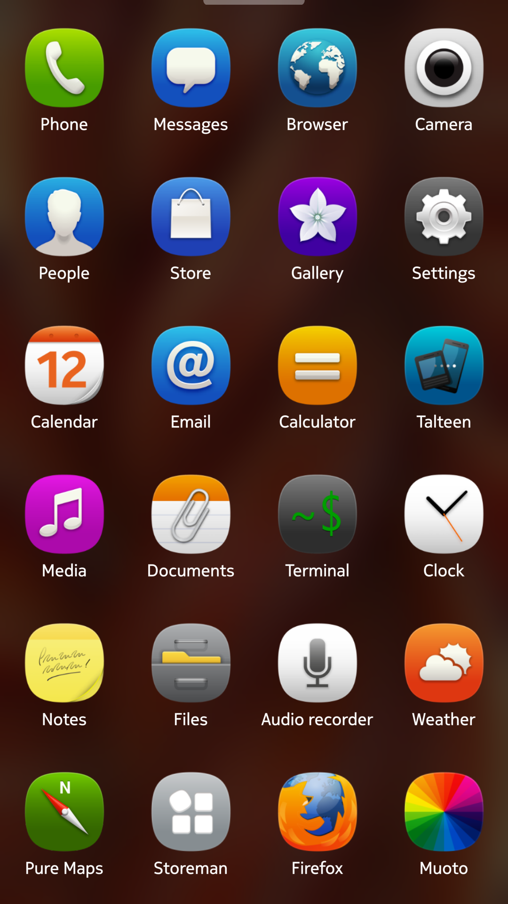

# Harmattan for Sailfish OS

MeeGo Harmattan-style icons and Nokia Pure UI font for **[Muoto](https://openrepos.net/content/fravaccaro/muoto-ui-themer)** on Sailfish OS.

 

## Requirements

Install **[Muoto 3.x](https://openrepos.net/content/fravaccaro/muoto-ui-themer)** first, then install this package and apply **Harmattan** in Muoto (fonts + icons).

## Request a new icon

Use the companion app or [open an issue](https://github.com/uithemer/harbour-themepack-harmattan/issues).

## Create custom theme packs

Documentation on how to create theme packs available [here](https://uithemer.github.io/harbour-muoto/).

## Translate

Request a new language or contribute to existing languages on the [Transifex project page](https://explore.transifex.com/fravaccaro/harmattan-theme/).

## Builds

- **OpenRepos:** https://openrepos.net/content/fravaccaro/harbour-themepack-harmattan
- **GitHub Releases:** https://github.com/uithemer/harbour-themepack-harmattan/releases

## Credits

### Fonts

- **Visual design reference:** Nokia Pure UI typeface, Nokia N9 / MeeGo Harmattan (Nokia).
- **Font files (community):** [Bang-Nokia](https://github.com/ExertisMicro-P/Bang-Nokia/tree/master/nokia/fonts/NokiaPure).

### Icons

- **Visual design reference:** Nokia N9 / MeeGo Harmattan UI (Nokia).
- **Icon artwork (community):** [hpluslabels Harmattan pack](https://xdaforums.com/t/themes-adw-launcherpro-apk-nokia-n9-meego-harmattan-v1-3-update.1363692) (XDA).

## Support

https://liberapay.com/fravaccaro
